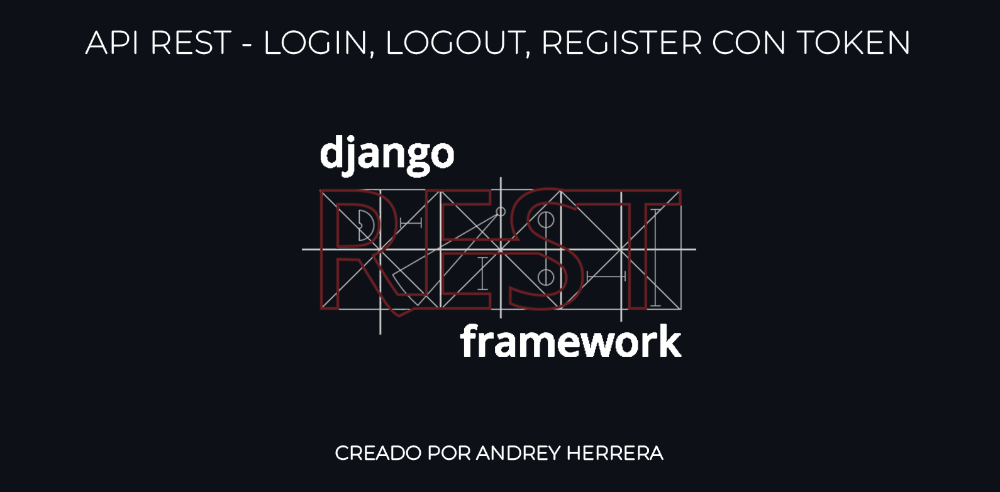
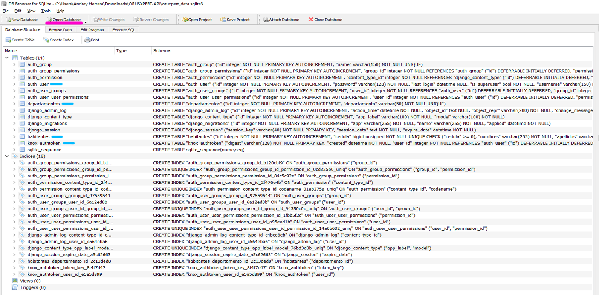
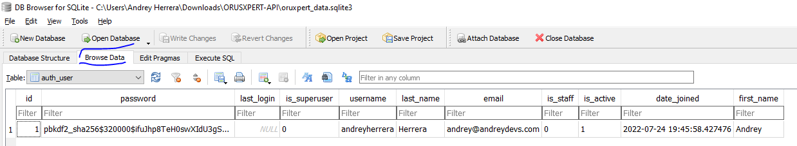
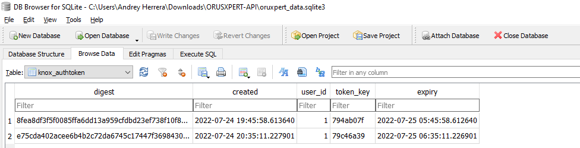
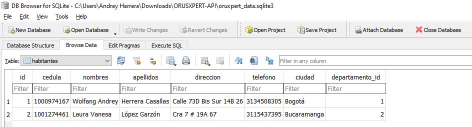

***

***
# Tabla de Contenido
1. [Información General](#general-info)
2. [Instalación](#installation)
3. [Request por API](#request-api)
4. [Base de Datos](#base-de-datos)
***
<a name="general-info"></a>
# -> Información General
### Esta es un App diseñada con Django Rest Framework, es una App que tiene un Login, un Logout y un Register con Autenticación por Token. cuando te Registras o Ingresas al sistema automaticamente te arroja un Token de Autenticación para poder hacer uso de los servicios. cuando Sales del sistema el automaticamente elimina tu Token de Autenticación para que no puedas hacer uso de los servicios.
### Debemos tener instalado PYTHON(3.10.x) y POSTMAN en nuestro sistema operativo para poder hacer uso de los REQUESTS.

***
<a name="installation"></a>
# -> Instalación
### Una vez descargado el repositorio, nos moveremos por la CONSOLA a la carpeta del Proyecto
### Procederemos a activar el Entorno Virtual, Instalar los Requeriments.txt y encender el Servidor.
```
$ cd C:\Users\UserName\Downloads\ORUSXPERT-API
$ venv\Scripts\activate.bat
$ (venv) pip install -r requirements.txt 
$ (venv) python manage.py runserver
```
### Si todo está correcto, nos debe salir así la consola.
```
Watching for file changes with StatReloader
Performing system checks...

System check identified no issues (0 silenced).
July 24, 2022 - 14:33:26
Django version 4.0.6, using settings 'Core.settings'
Starting development server at http://127.0.0.1:8000/
Quit the server with CTRL-BREAK.
```
### Nuestro servidor esta alojado en la siguiente ruta:
```
http://localhost:8000/
http://127.0.0.1:8000/
```
***
<a name="request-api"></a>
# -> Request por API
## ■ REGISTRO DE USUARIOS
### Mediante POSTMAN haremos la peticion con Metodo 'POST' a la ruta:
```
http://localhost:8000/api/register/
```
### Con un BODY - RAW de tipo JSON con la siguiente estructura.
```
{
    "username" : "nombre_de_usuario",
    "password" : "contraseña",
    "email" : "correo@dominio.com",
    "first_name" : "Nombre",
    "last_name" : "Apellido"
}
```
### Como resultado nos debe arrojar la información del usuario registrado con el token.
```
{
    "user_info": {
        "id": id,
        "username": "nombre_de_usuario",
        "email": "correo@dominio.com"
    },
    "token": "794ab07fc662c1ab0b6af61c3665d1ec50fc8df2879dd62f03380ae4d6831da1"
}

STATUS = 200 OK
```
### En este caso ya podemos hacer uso del TOKEN para usar los demas servicios.
#
## ■ LOGIN DE USUARIOS
### Mediante POSTMAN haremos la peticion con Metodo 'POST' a la ruta:
```
http://localhost:8000/api/login/
```
### Con un BODY - RAW de tipo JSON con la siguiente estructura.
```
{
    "username" : "nombre_de_usuario",
    "password" : "contraseña"
}
```
### Como resultado nos debe arrojar la información del usuario logueado con el token.
```
{
    "user_info": {
        "id": id,
        "username": "nombre_de_usuario",
        "email": "correo@dominio.com"
    },
    "token": "794ab07fc662c1ab0b6af61c3665d1ec50fc8df2879dd62f03380ae4d6831da1"
}

STATUS = 200 OK
```
### En este caso ya podemos hacer uso del TOKEN para usar los demas servicios.

#
## ■ LOGOUT DE USUARIOS
### Mediante POSTMAN haremos la peticion con Metodo 'POST' a la ruta:
```
http://localhost:8000/api/logout/
```
### En el HEADERS mandaremos el TOKEN de autenticación.
```
KEY : Authorization
VALUE : token 56dd6c0315dbfd115f84e543e67bec55fbd845a2b03d2b3e120b1ade2694ddce
```
### Como resultado no nos mostrara un mensaje.
```
{

}

STATUS = 204 NO CONTENT
```
### En este caso ya nuestro TOKEN ha sido eliminado y no podremos usar los demas servicios.
```
<DEBEMOS INICIAR SESION NUEVAMENTE PARA OBTENER UN NUEVO TOKEN>
```
### Si no mandamos el TOKEN de autenticación en el HEADERS, nos saldra el siguiente error.
```
{
    "Error": "Usuario no Autenticado"
}

STATUS = 401 UNAUTHORIZED
```

#
## ■ REGISTRO DE DEPARTAMENTOS
### El modelo 'Departamentos' ya cuenta con una lista predefinida de Departamentos de la Republica de Colombia que se encuentra alojada en el archivo 'App/choice.py'.
```
lista_departamentos = (
        ('Amazonas', 'Amazonas'),
        ('Antioquia', 'Antioquia'),
        ('Arauca', 'Arauca'),
        ('Atlántico', 'Atlántico'),
        ('Bogotá', 'Bogotá'),
        ('Bolívar', 'Bolívar'),
        ('Boyacá', 'Boyacá'),
        ('Caldas', 'Caldas'),
        ('Caquetá', 'Caquetá'),
        ('Casanare', 'Casanare'),
        ('Cauca', 'Cauca'),
        ('Cesar', 'Cesar'),
        ('Chocó', 'Chocó'),
        ('Córdoba', 'Córdoba'),
        ('Cundinamarca', 'Cundinamarca'),
        ('Guainía', 'Guainía'),
        ('Guaviare', 'Guaviare'),
        ('Huila', 'Huila'),
        ('La Guajira', 'La Guajira'),
        ('Magdalena', 'Magdalena'),
        ('Meta', 'Meta'),
        ('Nariño', 'Nariño'),
        ('Norte de Santander', 'Norte de Santander'),
        ('Putumayo', 'Putumayo'),
        ('Quindío', 'Quindío'),
        ('Risaralda', 'Risaralda'),
        ('San Andrés y Providencia', 'San Andrés y Providencia'),
        ('Santander', 'Santander'),
        ('Sucre', 'Sucre'),
        ('Tolima', 'Tolima'),
        ('Valle del Cauca', 'Valle del Cauca'),
        ('Vaupés', 'Vaupés'),
        ('Vichada', 'Vichada')
)
```
### Mediante POSTMAN haremos la peticion con Metodo 'POST' a la ruta:
```
http://localhost:8000/api/departamento/
```
### En el HEADERS mandaremos el TOKEN de autenticación.
```
KEY : Authorization
VALUE : token 56dd6c0315dbfd115f84e543e67bec55fbd845a2b03d2b3e120b1ade2694ddce
```
### Con un BODY - RAW de tipo JSON con la siguiente estructura.
```
{
    "departamento" : "Nombre del Departamento"
}
```
### Como resultado nos debe arrojar la información del departamento.
```
{
    "id": 1,
    "departamento": "Bogotá"
}

STATUS = 200 OK
```
### Si no mandamos el TOKEN de autenticación en el HEADERS, nos saldra el siguiente error.
```
{
    "Error": "Usuario no Autenticado"
}

STATUS = 401 UNAUTHORIZED
```

#
## ■ VER LISTA DE DEPARTAMENTOS
### Mediante POSTMAN haremos la peticion con Metodo 'GET' a la ruta:
```
http://localhost:8000/api/departamento/
```
### En el HEADERS mandaremos el TOKEN de autenticación.
```
KEY : Authorization
VALUE : token 56dd6c0315dbfd115f84e543e67bec55fbd845a2b03d2b3e120b1ade2694ddce
```
### Como resultado nos debe arrojar la información del / los departamento/s.
```
[
    {
        "id": 1,
        "departamento": "Atlántico"
    },
    {
        "id": 2,
        "departamento": "Santander"
    },
    {
        "id": 3,
        "departamento": "Antioquia"
    }

    STATUS = 200 OK
]
```
### Si no mandamos el TOKEN de autenticación en el HEADERS, nos saldra el siguiente error.
```
{
    "Error": "Usuario no Autenticado"
}

STATUS = 401 UNAUTHORIZED
```

#
## ■ ACTUALIZAR UN DEPARTAMENTO
### Mediante POSTMAN haremos la peticion con Metodo 'PUT' a la ruta:
```
http://localhost:8000/api/departamento/<id:departamento>
```
### En el HEADERS mandaremos el TOKEN de autenticación.
```
KEY : Authorization
VALUE : token 56dd6c0315dbfd115f84e543e67bec55fbd845a2b03d2b3e120b1ade2694ddce
```
### Con un BODY - RAW de tipo JSON con la siguiente estructura.
```
{
    "departamento" : "Nuevo Nombre del Departamento"
}
```
### Como resultado nos debe arrojar la nueva información del departamento.
```
{
    "id": 1,
    "departamento": "Bogotá"
}

STATUS = 200 OK
```
### Si no mandamos el TOKEN de autenticación en el HEADERS, nos saldra el siguiente error.
```
{
    "Error": "Usuario no Autenticado"
}

STATUS = 401 UNAUTHORIZED
```

#
## ■ ELIMINAR UN DEPARTAMENTO
### Mediante POSTMAN haremos la peticion con Metodo 'DELETE' a la ruta:
```
http://localhost:8000/api/departamento/<id:departamento>
```
### En el HEADERS mandaremos el TOKEN de autenticación.
```
KEY : Authorization
VALUE : token 56dd6c0315dbfd115f84e543e67bec55fbd845a2b03d2b3e120b1ade2694ddce
```
### Como resultado no nos mostrara un mensaje.
```
{

}

STATUS = 204 NO CONTENT
```
### Si no mandamos el TOKEN de autenticación en el HEADERS, nos saldra el siguiente error.
```
{
    "Error": "Usuario no Autenticado"
}

STATUS = 401 UNAUTHORIZED
```

#
## ■ REGISTRO DE HABITANTES
### Mediante POSTMAN haremos la peticion con Metodo 'POST' a la ruta:
```
http://localhost:8000/api/habitante/
```
### En el HEADERS mandaremos el TOKEN de autenticación.
```
KEY : Authorization
VALUE : token 56dd6c0315dbfd115f84e543e67bec55fbd845a2b03d2b3e120b1ade2694ddce
```
### Con un BODY - RAW de tipo JSON con la siguiente estructura.
```
{
    "cedula" : <Numero de Cedula>,
    "nombres" : "Nombres del Habitante",
    "apellidos" : "Apellidos del Habitante",
    "direccion" : "Direccion del Habitante",
    "telefono" : <Numero de Telefono>,
    "ciudad" : "Ciudad del Habitante",
    "departamento" : <id:departamento>
}
```
### Como resultado nos debe arrojar la información del habitante.
```
{
    "id": 1,
    "cedula": 1010223456,
    "nombres": "Gabriel Enrique",
    "apellidos": "Mogollon Torres",
    "direccion": "Avenida 54 - 63A 15",
    "telefono": 3112221223,
    "ciudad": "Bogotá",
    "departamento": 1
}

STATUS = 201 CREATED
```
### Si no mandamos el TOKEN de autenticación en el HEADERS, nos saldra el siguiente error.
```
{
    "Error": "Usuario no Autenticado"
}

STATUS = 401 UNAUTHORIZED
```

#
## ■ VER LISTA DE HABITANTES
### Mediante POSTMAN haremos la peticion con Metodo 'GET' a la ruta:
```
http://localhost:8000/api/habitante/
```
### En el HEADERS mandaremos el TOKEN de autenticación.
```
KEY : Authorization
VALUE : token 56dd6c0315dbfd115f84e543e67bec55fbd845a2b03d2b3e120b1ade2694ddce
```
### Como resultado nos debe arrojar la información del / los habitante/s.
```
[
    {
        "id": 1,
        "cedula": 1010223456,
        "nombres": "Gabriel Enrique",
        "apellidos": "Mogollon Torres",
        "direccion": "Avenida 54 - 63A 15",
        "telefono": 3112221223,
        "ciudad": "Bogotá",
        "departamento": 1
    },
    {
        "id": 2,
        "cedula": 1001274461,
        "nombres": "Laura Vanesa",
        "apellidos": "López Garzón",
        "direccion": "Cra 7 # 19A 67",
        "telefono": 3115437395,
        "ciudad": "Bucaramanga",
        "departamento": 2
    }
]

STATUS = 200 OK
```
### Si no mandamos el TOKEN de autenticación en el HEADERS, nos saldra el siguiente error.
```
{
    "Error": "Usuario no Autenticado"
}

STATUS = 401 UNAUTHORIZED
```

#
## ■ ACTUALIZAR UN HABITANTE
### Mediante POSTMAN haremos la peticion con Metodo 'PUT' a la ruta:
```
http://localhost:8000/api/habitante/<cedula>
```
### En el HEADERS mandaremos el TOKEN de autenticación.
```
KEY : Authorization
VALUE : token 56dd6c0315dbfd115f84e543e67bec55fbd845a2b03d2b3e120b1ade2694ddce
```
### Con un BODY - RAW de tipo JSON con la siguiente estructura.
```
{
    "cedula" : <Nuevo Numero de Cedula>,
    "nombres" : "Nuevos Nombres del Habitante",
    "apellidos" : "Nuevos Apellidos del Habitante",
    "direccion" : "Nueva Direccion del Habitante",
    "telefono" : <Nuevo Numero de Telefono>,
    "ciudad" : "Nueva Ciudad del Habitante",
    "departamento" : <id:nuevo_departamento>
}
```
### Como resultado nos debe arrojar la información del habitante con información acutalizada.
```
{
    "id": 1,
    "cedula": 1000974167,
    "nombres": "Wolfang Andrey",
    "apellidos": "Herrera Casallas",
    "direccion": "Calle 73D Bis Sur 14B 26",
    "telefono": 3134508305,
    "ciudad": "Bogotá",
    "departamento": 1
}

STATUS = 201 CREATED
```
### Si no mandamos el TOKEN de autenticación en el HEADERS, nos saldra el siguiente error.
```
{
    "Error": "Usuario no Autenticado"
}

STATUS = 401 UNAUTHORIZED
```

#
## ■ ELIMINAR UN HABITANTE
### Mediante POSTMAN haremos la peticion con Metodo 'DELETE' a la ruta:
```
http://localhost:8000/api/habitante/<cedula>
```
### En el HEADERS mandaremos el TOKEN de autenticación.
```
KEY : Authorization
VALUE : token 56dd6c0315dbfd115f84e543e67bec55fbd845a2b03d2b3e120b1ade2694ddce
```

### Como resultado no nos mostrara un mensaje.
```
{


}

STATUS = 204 NO CONTENT
```
### Si no mandamos el TOKEN de autenticación en el HEADERS, nos saldra el siguiente error.
```
{
    "Error": "Usuario no Autenticado"
}

STATUS = 401 UNAUTHORIZED
```

#
## ■ VER LISTA DE HABITANTES DE UN DEPARTAMENTO
### Mediante POSTMAN haremos la peticion con Metodo 'GET' a la ruta:
```
http://localhost:8000/api/departamento_habitantes/<id:departamento>/
```
### En el HEADERS mandaremos el TOKEN de autenticación.
```
KEY : Authorization
VALUE : token 56dd6c0315dbfd115f84e543e67bec55fbd845a2b03d2b3e120b1ade2694ddce
```
### Como resultado nos debe arrojar la información del / los habitante/s por departamento.
```
[
    {
        "id": 1,
        "cedula": 1000974167,
        "nombres": "Wolfang Andrey",
        "apellidos": "Herrera Casallas",
        "direccion": "Calle 73D Bis Sur 14B 26",
        "telefono": 3134508305,
        "ciudad": "Bogotá",
        "departamento": 1
    }
]


STATUS = 200 OK
```
### Si no mandamos el TOKEN de autenticación en el HEADERS, nos saldra el siguiente error.
```
{
    "Error": "Usuario no Autenticado"
}

STATUS = 401 UNAUTHORIZED
```

***
<a name="base-de-datos"></a>
# -> BASE DE DATOS (SQLITE3)
### Esta es un App esta diseñada con SQLite 3 que es nativa del Framework Django. A mi parecer es una buena base de datos para el tamaño de la App, la cual cuenta solo con dos tablas : 'Departamentos', 'Habitantes'.
### Para realizar las consultas en SQLite 3 es bastante sencillo, debemos descargar un software totalmente gratuito desde la pagina oficial de <a href="sqlitebrowser.org">'sqlitebrowser.org'</a> llamado DB BROWSER SQLITE.

### DESCARGA DIRECTA-> <a href="https://download.sqlitebrowser.org/SQLiteDatabaseBrowserPortable_3.12.2_English.paf.exe">DB BROWSER SQLITE PORTABLE</a>

#
## ■ DB BROWSER SQLITE
### Estando en el software mencionado anteriormente abriremos la base de datos de la App llamada 'oruxpert_data.sqlite3'
### Encontraremos las dos tablas creadas desde 'App/Models.py' y además podremos ver dos tablas más creadas, una tabla creada automaticamente por Django Framework y la otra tabla creada por el modulo 'KNOX' que trabaja con Django Rest Framework.


#
## ■ TABLA: 'auth_user'
### No estamos usando el metodo 'createsuperuser' nativo de DJANGO para la creación de usuarios.
```
python manage.py createsuperuser
```
### Los usuarios los estamos creando mediante el Request API 'REGISTRO DE USUARIOS'.
### Automaticamente no Encripta la contraseña con el metodo 'SHA-256'.


#
## ■ TABLA: 'knox_authtoken'
### Con el modulo 'knox' nos esta proporcionando un nuevo TOKEN cuando nos 'REGISTRAMOS' o nos 'LOGUEAMOS'. este TOKEN se verifica en los servicios y una vez hagamos un 'LOGOUT' este TOKEN expirara y no funcionara más.


#
## ■ TABLA: 'habitantes'
### Aca almacenamos los datos de los habitantes registrados mediante el Request API 'REGISTRO DE HABITANTE' la cual comparte una llave foranea con la TABLA: 'departamentos' para hacer la validación si este habitante es de un departamento.


#
## ■ TABLA: 'departamentos'
### Aca almacenamos los datos de los departamentos registrados mediante el Request API 'REGISTRO DE DEPARTAMENTO' la cual tiene como predefinido ciertos departamentos.


***

***